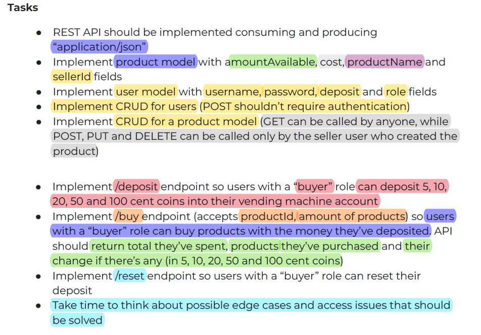

# Vending Machine API
This is the project is about designing an API for a vending machine, allowing users with a “seller” role to add, update or remove products. In contrast, users with a “buyer” role can deposit coins into the machine and make purchases. Your vending machine should only accept 5, 10, 20, 50, and 100 cent coins.

The requirements is to make some tasks 


## Solution

I used Django framework and Django Rest Framework to implement the project, I have made 7 endpoints.

## How to run
> This is a dockerized application so just clone the repo and run the following command this will run the app at **localhost:8000** 
``` bash
docker-compose up
```

#### For Documentation:
[](https://www.postman.com/flight-operator-48734873/workspace/vendingmachineapi/documentation/25235691-3e29f07b-59c5-4f11-bca8-4b2c649f0ec9)
### /users 
>Make **GET** and **POST** requests with no permission or authentication needed as required.
### /users/<id> 
Can make **PUT** and **DELETE** requests that can make edits to the authenticated user only and not any other user.
### /products
> Can make **GET** and **POST** requests.
* **GET** No need for authentication to make a GET request.
* **POST** You need to be authenticated and also have the seller create a new product.
### /products/<id>
> Can make **PUT** and **DELETE** requests, To edit and use this endpoint you need to have **seller** role and can edit the the products created by the authenticated user only.
### /deposit
> Can make **POST** requests only and needs to be authenticated with **buyer** role to make requests.
users use this endpoint to deposit money to the machine in the coins of [5, 10, 20, 50, 100] only as required.
#### Example request body:

```
{
  "coins": {
    "5": 10,
    "10": 5,
    "20": 2,
    "50": 3,
    "100": 1
  }
}
```
### /reset
> Can make **POST** requests only and needs to be authenticated with **buyer** role to make requests, Users use this endpoint to reset their deposit money to Zero **No Body Needed**.

### /buy
> Can make **POST** requests only and needs to be authenticated with **buyer** role to make requests, Users use this endpoint to buy products as they specify the products IDs and amount of each product and return the remaining change of their deposit and reset the deposit of the user in Database.
#### Example request body:
```
{
    "products": [
        {
            "productId": 11
        },
        {
            "productId": 12,
            "amount": 2
        },
        {
            "productId": 13,
            "amount": 1
        }
    ]
}
```
#### Example Response:
```
{
    "message": "Purchase successful",
    "total_spent": 50,
    "purchased_products": [
        {
            "productId": 1
        },
        {
            "productId": 2,
            "amount": 2
        },
        {
            "productId": 3,
            "amount": 2
        }
    ],
    "change": {
        "100": 3.0,
        "20": 2.0
    }
}
```


